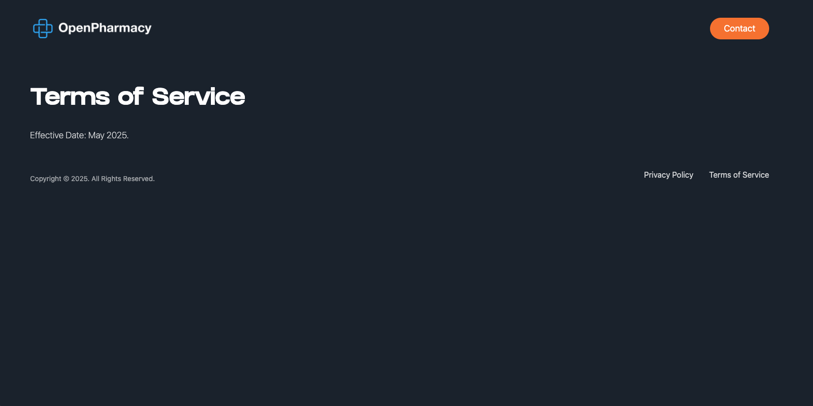
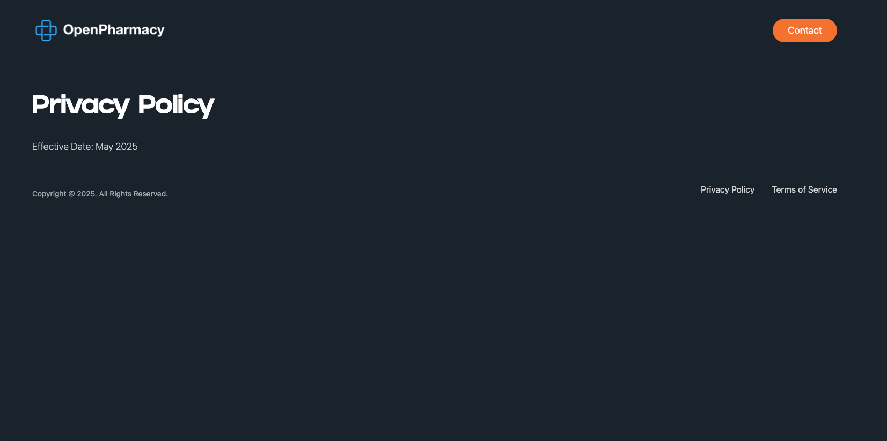

# How to Change Data

1. Open `src/data/Content.js`
2. Modify the content object:
   ```javascript
   export const content = {
     heading: {
       line1: "Digital Scripts,",
       line2: "Done Right",
     },
     description: {
       text: "Your secure digital wallet for Australian electronic prescriptions, fully compliant with ADHA standards. Its robust security simplifies storing, accessing, and sharing your scripts with ease. Enjoy seamless prescription management.",
     },
     privacyPolicy: {
       text: "Effective Date: May 2025 ",
     },
     termsOfService: {
       text: "Effective Date: May 2025.",
     },
   ```
## Views

### Desktop View





### Mobile View


## Technologies Used

- React + Vite
- Tailwind CSS
- React Router DOM

## Navigate to project directory

cd landing-page

## Install dependencies

npm install

## Start development server

npm run dev
